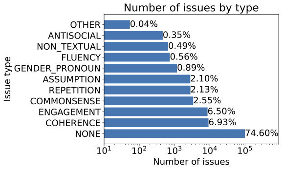
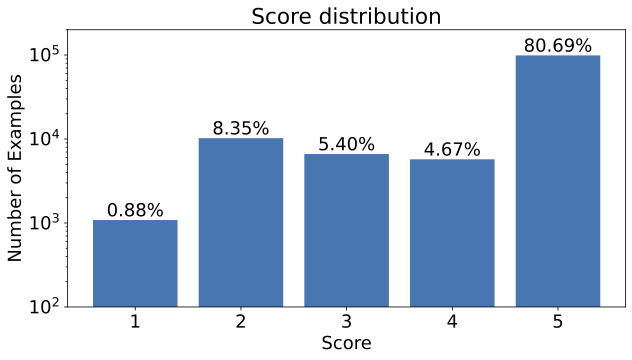

# Official repository for the EMNLP (findings) [paper](https://arxiv.org/abs/2408.10902): *"Soda-Eval: Open-Domain Dialogue Evaluation in the age of LLMs"*

```
@inproceedings{mendonca-etal-2024-soda,
    title = "Soda-Eval: Open-Domain Dialogue Evaluation in the age of {LLM}s",
    author = "Mendon{\c{c}}a, John  and
      Trancoso, Isabel  and
      Lavie, Alon",
    editor = "Al-Onaizan, Yaser  and
      Bansal, Mohit  and
      Chen, Yun-Nung",
    booktitle = "Findings of the Association for Computational Linguistics: EMNLP 2024",
    month = nov,
    year = "2024",
    address = "Miami, Florida, USA",
    publisher = "Association for Computational Linguistics",
    url = "https://aclanthology.org/2024.findings-emnlp.684/",
    doi = "10.18653/v1/2024.findings-emnlp.684",
    pages = "11687--11708",
}
```

## Soda-Eval

Soda-Eval is a dialogue quality dataset that includes over 120 thousand turn level assessments covering 10 thousand dialogues. These annotations are conducted by GPT-4 on top of the SODA dialogue dataset (generated with LLMs), and target a diverse range of quality aspects such as Coherence, Commonsense and Engagement.


### Download

You can load the Soda-Eval dataset from the [HuggingFace hub](https://huggingface.co/datasets/Johndfm/soda_eval) as the following:

```python
from datasets import load_dataset

raw_datasets = load_dataset("Johndfm/soda_eval")

train_dataset = raw_datasets["train"]
val_dataset = raw_datasets["val"]
test_dataset = raw_datasets["test"]
```

### Statistics


We present statistics on the number of identified issues and the score distribution on Soda-Eval below.




